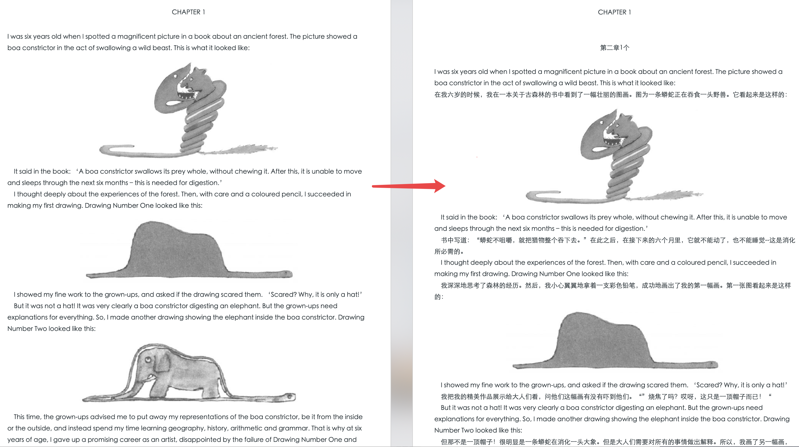

# epub-bilingual-translation
Translate epub books in a bilingual way

Originally from [epub-translator](https://github.com/Frully/epub-google-translate)

## demo


## Usage
1. Fill your own keys in `tencentClientConfig.ts`, applied from `https://cloud.tencent.com/product/tmt`

2. Run
```
node /lib/main.js [pathToEpubFile]
```

## Similar projects
+ [epub-translator](https://github.com/sharplab/epub-translator)
+ [彩云小译](https://fanyi.caiyunapp.com/#/web)
+ [知云文献翻译](http://www.zhiyunwenxian.cn/)
+ [bilingual-pdf](https://github.com/kingbase/bilingual-pdf)
+ [CopyTranslator](https://github.com/CopyTranslator/CopyTranslator)
